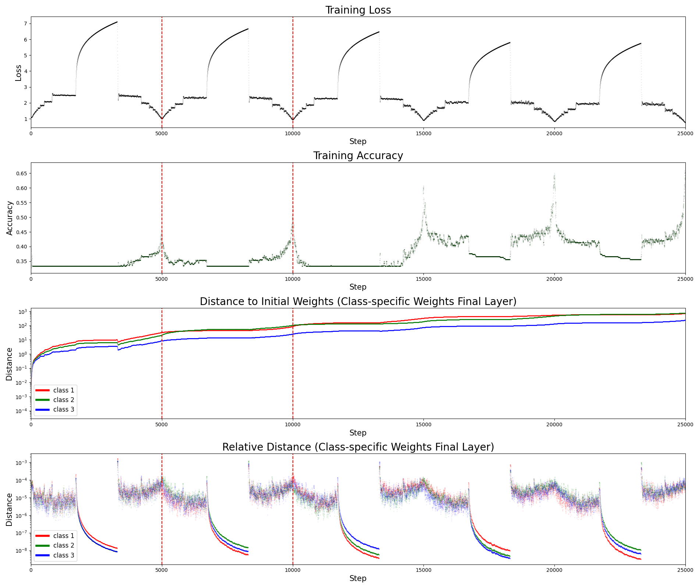

# El aprendizaje automático como sistema físico fuera del equilibrio

> En lugar de utilizar una función de coste que evoluciona dinámicamente, seguimos un enfoque diferente. En la práctica, no se utiliza todo el conjunto de datos a la vez para optimizar, principalmente porque no es eficiente computacionalmente. En su lugar, se seleccionan aleatoriamente pequeños subconjuntos del conjunto de datos en cada iteración, lo que se conoce como descenso de gradiente estocástico (SGD). El enfoque que adoptamos aquí combina esta idea con la pérdida dinámica: el subconjunto de datos (o lote) que tomamos en cada iteración incluye ejemplos aleatorios de distintas clases, pero en proporciones cíclicas que varían en el tiempo.

> Utilizando este método, nos centramos en entender cómo se reconfigura internamente una red neuronal entrenada mediante lotes de composición dinámica. Nuestro objetivo es estudiar si esta dinámica induce una reorganización progresiva de los parámetros, similar a la resolución secuencial de frustraciones observada en redes físicas. Para ello, analizaremos desde métricas globales -como la distancia $L_2$ al origen y la evolución macroscópica de las fronteras de decisión- hasta aspectos que llamaremos microscópicos -como los gradientes principales, la evolución de los parámetros capa por capa y la geometría de sus distribuciones. En conjunto, estos experimentos buscan identificar patrones que emerjan de forma espontánea y permitan entender cómo se coordinan las distintas partes de la red para resolver distintas tareas sin interferencias destructivas.

# Autor
Este código fue escrito por [Nicolas Ratier Werbin](mailto:nicolasratierwerbin@gmail.com).
<!-- # Figuras Adicionales
## Análisis macroscópico de la dinámica de aprendizaje
### Resultados con amplitud $A = 70$

### Resultados con amplitud $A=10$

### Resultados sin oscilaciones, $A=1$

## Análisis microscópico de la reconfiguración interna

### Capa oculta de tamaño $N=500$

### Capa oculta de tamaño $N=50$

## Material Adicional

  

https://github.com/user-attachments/assets/3de7c7ff-c5a7-4c0b-a021-2531b6a3acba

https://github.com/user-attachments/assets/d7a8b3bf-d558-4ed9-b2b0-370461d25568

# Autor
Este código fue escrito por [Nicolas Ratier Werbin](mailto:nicolasratierwerbin@gmail.com).

